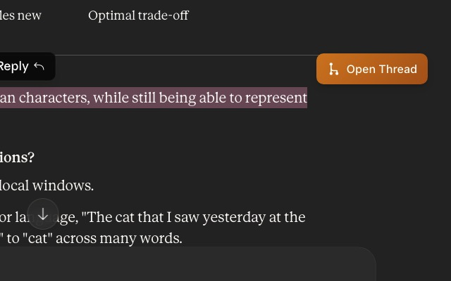
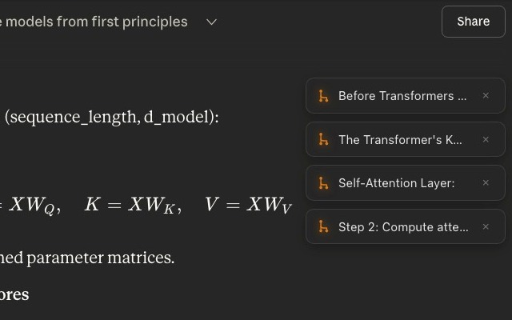

# Tangent – Threaded Chat for Claude

**Branch off into side threads without leaving your main conversation.**

[](https://chromewebstore.google.com/detail/tangent-%E2%80%93-threaded-chat-f/dhacmfmpmgedcagknopapipcgcfcpaae)

[](https://www.youtube.com/watch?v=1BIQE1X34EA)





## The Problem

You're deep into a Claude conversation. You've finally found the explanation that clicks — a dense paragraph breaking down exactly how something works. But now you have a follow-up question.

So you type it. Claude responds. You scroll back up to re-read that paragraph. Then another question. More scrolling. You're hunting for that one section you were studying, but the conversation keeps growing beneath you. Your flow state is gone. The thing you were trying to understand is now buried under twelve messages of back-and-forth.

**Your options today:**
1. Ask the follow-up in the same thread → pollutes your clean conversation
2. Open a new tab → lose context, friction, disjointed experience
3. Just don't ask → lost learning opportunity

## The Solution

Tangent fixes this.

Select any text in your Claude conversation and open a threaded side panel — a fresh Claude chat that lives right next to your main conversation. Ask follow-up questions, dig deeper, explore rabbit holes. Your main conversation stays exactly where you left it.

**No scrolling. No context switching. No lost trains of thought.**


## How It Works

1. **Select text** in any Claude conversation
2. **Click "Open Thread"** (or press `Cmd+\` for a blank thread)
3. **A floating panel opens** with a fresh Claude chat
4. **Your selected context** is automatically copied for easy reference
5. **Minimize threads to tabs**, expand them later — you'll be scrolled right back to where you branched off


## Features

### Built for deep learning sessions
- **Multiple simultaneous threads** — open different threads for different topics
- **Incognito by default** — each thread runs in temporary mode, no clutter in your sidebar
- **Minimize & restore** — minimize a thread, keep reading, restore it later with a single click
- **Visual scroll-back** — when you re-open a minimized thread, the original text highlights in yellow so you instantly reconnect with the context

### Keyboard shortcuts
| Shortcut | Action |
|----------|--------|
| `Cmd+\` | Open a blank thread |


### Lightweight & private
- Runs entirely locally in your browser
- No external network requests (except loading claude.ai in the panel)
- No data collection, no analytics, no tracking
- Uses your existing Claude subscription — no API key needed
- Open source

## Installation

### From Source (Developer Mode)

1. Clone or download this repository
2. Open Chrome and navigate to `chrome://extensions/`
3. Enable **Developer mode** (toggle in top-right)
4. Click **Load unpacked**
5. Select the `claude-thread-opener` folder
6. Navigate to [claude.ai](https://claude.ai) and start using Tangent

### From Chrome Web Store

[**Install Tangent from the Chrome Web Store**](https://chromewebstore.google.com/detail/tangent-%E2%80%93-threaded-chat-f/dhacmfmpmgedcagknopapipcgcfcpaae)

## Why Tangent?

Claude is incredible for learning complex topics — programming concepts, research papers, technical documentation. But the single-thread chat format forces a painful choice: keep reading or ask a question. Tangent removes that trade-off. Branch off, explore, come back. Your reading flow stays intact.

**Stop scrolling. Start branching.**

## File Structure

```
claude-thread-opener/
├── manifest.json      # Extension configuration (Manifest V3)
├── content.js         # Main logic: selection, button, panel, iframe
├── styles.css         # UI styling
├── icons/             # Extension icons
│   ├── icon16.png
│   ├── icon48.png
│   └── icon128.png
├── images/            # Screenshots
└── README.md
```

## Configuration

Key settings are at the top of `content.js`:

```javascript
const CONFIG = {
  minSelectionLength: 10,    // Minimum characters to trigger button
  buttonOffsetX: 10,         // Button position offset from selection
  buttonOffsetY: -40,
  panelWidth: 480,           // Default panel dimensions
  panelHeight: 600,
  panelMargin: 20,           // Panel margin from viewport edge
  debounceMs: 150            // Selection debounce time
};
```

## Known Limitations

- **Iframe dependency** — The panel loads Claude in an iframe. If Anthropic changes their security headers, this may break (a fallback "open in new tab" option is provided).
- **Auto-paste** — Works in most cases, but may fail if a previous thread was left unused. Manual paste (`Cmd+V`) always works as a fallback.
- **Dark mode only** — Currently styled for Claude's dark theme.

## Contributing

Issues and PRs welcome. Potential improvements:


- [ ] Lazy unload minimized iframes (memory optimization)
- [ ] Thread history / persistence across sessions
- [ ] ChatGPT and Gemini support
- [ ] Customizable keyboard shortcuts

## License

MIT License. See [LICENSE](LICENSE) for details.


